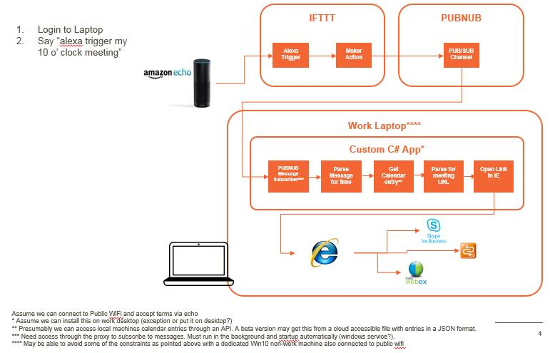

# node-start-conference-call

A prototype to launch a conference call by voice.

Assumes you have access to either Amazon Echo or Google Home/Google Assistant.

Following the setup below, say to alex/google: "trigger my conference call" and your preferred conference will start up.

## Planned Architecture

## Current Limitations / TODO list

* Cannot retrieve actual calendar details - conference call URL is hard coded
* Cannot operate behind a corporate firewall

## Setup

### 1. Configure PubNub

* Create an account on http://www.pubnub.com
* In the admin area, create a new application
* For that application create a new keyset
* Copy the publish and subscribe keys for later

### 2. Configure IFTTT

* Create an account on http://www.ifttt.com
* Under account name, select New Applet 
* Click on `+this` and find either alexa or google assistant
* Select the `Say a Simple Phrase` option
* For Alexa type in `my conference call`, for Google Assistant type `trigger my conference call` - ensure they are all lowercase!
* In the reponse type `okay, connecting you now` or something similar
* Hit create action and then select `+that`
* Search for the Maker channel
* In the URL field type: http://pubsub.pubnub.com/publish/<your-pub-key>/<your-sub-key>/0/startconferencecall/0/"startconferencecall" replacing <your-***-key> with those you copied from above
* Leave it as a GET request and create the applet

### 3. Configure Nodejs

* Install nodejs from the web or by contacting your admin / using corporate software directory
* Clone or Download this project, extract if a zip file
* Edit file etc/pubnub.json file with a text editor and substitute in the publish/subscribe keys
* Edit file etc/calendar.json file with a text editor and subsitute in the URL your Live Meeting, Skype or webex.
* Open a command window (windows key + R, then type cmd and hit OK)
* Move to the directory where you downloaded the application
* Type `npm install` to install the dependencies
* Type `npm start` to start the service

